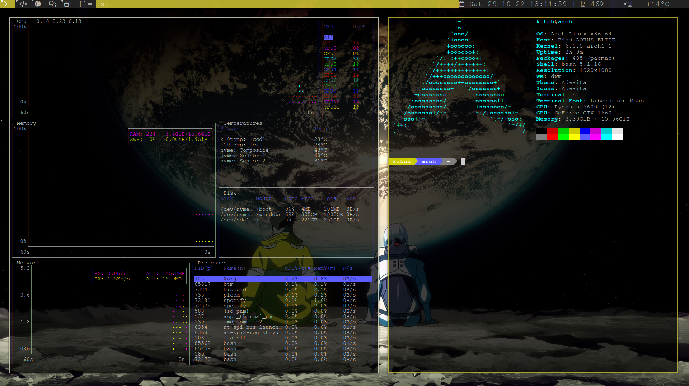

<div align="center">

## DWM

This is my DWM setup? I'm relativley new to the whole ricing and arch community.
if you have anything you want to say to me you can find my [contacts here](https://github.com/Kitchvx/Kitchvx).

## Screenshot


## Wallpaper
You can download the wallpaper from [here](wallpaper.jpg) or [imgur](https://imgur.com/a/4fif39V)

## Installing & Compiling

</div>

- First update the database:
```
sudo pacman -Syy
```

- Then you will need some dependencies if you don't have them already:
```
sudo pacman -S xorg-server xorg-xinit xorg-xrandr libx11 libxinerama libxft webkit2gtk base-devel ttf-font-awesome
```

- Now clone DWM:
```
git clone https://github.com/Kitchvx/dwm
```
- Now compile it!
```
cd dwm/
```
```
sudo make clean install
```
- You might as well get [st](http://st.suckless.org/) and [dmenu](https://tools.suckless.org/dmenu/) unless you want to use another menu and terminal. Just do the samne with these. (I haven't done any changes to these at the moment)
```
git clone https://git.suckless.org/st
```
```
cd st/
```
```
sudo make clean install
```
```
cd ..
```
```
git clone https://git.suckless.org/dmenu
```
```
cd dmenu/
```
```
sudo make clean install
```
```
cd ..
```

- Now create or edit ".xinitrc".
```
vim .xinitrc
```

- Inside xinitrc write:
```
exec dwm
```

Last but not least, run ``startx`` and you will start DWM.

(I have writting this from memory so im not sure it is correct as of right now).

<div align="center">

## Meta

Distributed under the MIT License. See ``LICENSE`` for more information.

[https://github.com/Kitchvx/dwm](https://github.com/Kitchvx/dwm)

## Contributing

1. Fork it (<https://github.com/Kitchvx/dwm/fork>)
2. Create your feature branch (`git checkout -b feature/fooBar`)
3. Commit your changes (`git commit -am 'Add some fooBar'`)
4. Push to the branch (`git push origin feature/fooBar`)
5. Create a new Pull Request

</div>
